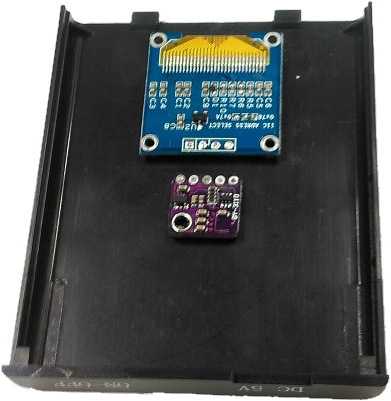
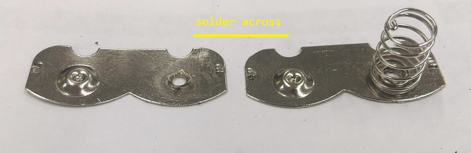
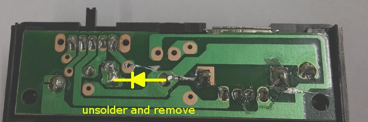

# Portable-Digital-Compass

Not just a great project for the coming holiday break, this compass can be used to find your way home. The addition of a functional USB output will ensure if you're still lost, you can always charge your phone and call for help.									


## Bill of materials

|Qty| Code | Description |
|---|---|---|
|1 | [XC4384](http://jaycar.com.au/p/XC4384) | OLED Module
|1 | [XC4414](http://jaycar.com.au/p/XC4414) | Arduino Nano
|1 | [XC4496](http://jaycar.com.au/p/XC4496) | Compass/ Magnetometer Module
|1 | [WC6026](http://jaycar.com.au/p/WC6026) | Socket Socket leads
|1 | [ZV1505](http://jaycar.com.au/p/ZV1505) | voltage regulator 5V
|1 | [MP3083](http://jaycar.com.au/p/MP3083) | 4AA battery bank with USB
|1 | [SB2300](http://jaycar.com.au/p/SB2300) | rechargable 14500 battery

## Software and Libraries

| Library | Author | Version |
| --- | --- | --- |
| Adafruit_GFX | Adafruit | 1.0.2 |
| Adafruit_SSD1306 | Adafruit | 1.1.2 |
| I2C-Sensor_Lib | Ingmar Splitt | 0.8.2 |


## Connection table

| Nano | Compass Module | OLED Screen |
| --- | --- | --- |
| 3v3 | VCC | VCC |
| A4 | SDA | SDA |
| A5 | SCL | SCL |
| GND | GND | GND |

## Assembly

*Note: We've found that this project can have quite a few slip-ups during assembly, so be sure to test early and test often, as hot-glue is difficult to get off if you make a mistake. Use a breadboard if you're unsure about the circuit.*


First step is to remove the pins from the modules, This is a common task that we've covered before, but if you haven't done it before, check out [This guide](https://www.jaycar.com.au/removing-headers)

You want to remove headers from the Nano, OLED and magnetometer.


If you look carefully at the modules, you'll find that they both have SCL and SDA data lines inline with each other; this is the I2C databus, and a good feature of the I2C is that they can connect to the same lines, which is exactly what we're going to do.

We first need to cut a window out for the OLED screen, so position it like so, on the "tab" side of the battery case lid.



We want the modules to sit in the centre of the lid, with the arduino on top, as this is the only place where we have room for all the electronics in the case.

Use a sharp knife or screwdriver to run around the edges of the glass screen so you know how and where to cut out.

Then cut out the window, and file it down so it's smooth. When checking for the OLED to fit, be sure not to push too hard, as the glass is thin and can break easily.


We've also cut a little relief for the OLED cable to run to the back of the module.

Now that the window is cut out, carefully place the OLED and Magnetometer so that the SCL and SDA lines line up with each other, and hot-glue them in place.

Use wires to bridge across the joints, you can try to use the socket-socket leads here, but we found it easier to use solid-core wire, like some cat5 cable we had lying around.

Connect SCL and SDA to each other, and also connect the Ground and VCC pins to each other, most OLED modules have the Ground on the outside position, so you will have to cross the wires a bit, which we did with a small bit of sheathing to isolate the two from each other:


Then place the Nano on top, with the USB facing out, and the wires underneath curving to the left so that they can bend up and connect to the 3v3, ground, and SDA/SCL connections on the top of the arduino.

Have the arduino about 5mm away from the edge of the lid. Below, our image has it further back, but we had to change it when we were putting everything together, as the back of the arduino was hitting the PCB power circuit.


Here, the SDA and SCL are connected to A4 and A5, as needed. The VCC line is connected to the 3v3 pin, and we connected the ground to the case of the USB connection; this is a perfectly valid way to save a bit of space and trouble with routing the wire to GND.

Once the lid is done, we move on to the housing for the batteries.

Unscrew the two screws that enclose the PCB and pull it out. You can use some needle-nose pliers to pull out all of the terminals for the battery case, as we're changing it around a little.


Notice that two of the terminals look the same; these two terminals are the ones that we want to begin to modify. Pull the spring off one of them so it lies fairly flat with itself, and solder that spring connection to the nub of the other:



You can also trim, snip, cut, or dremel away the centre barrier in the battery compartment. This is why the modules and the arduino is stacked on the lid.

Place the two terminals back in the bottom half of the case.


Looking at the PCB board, you can see a small diode to protect against reverse polarity. Remove this, as the 7805 we are using will act as a diode anyway.



Attach some wires to the 7805 leads so that you have a bit of working room and connect it to the points shown below. You want the power coming from the battery to go through the 7805 before going to the switch.


Once the regulator is on, you can tuck it away under the PCB board and screw the board back down, putting the battery terminals back where they belong.


*Regulator in hiding*

Finally, connect the new 5V output and battery ground to the nano with some wires; Be sure to use 5V **from the switch** and not from the regulator, otherwise you will never be able to turn the unit off.


## Programming

Install the libraries, select NANO from the menu (old bootloader, if it gives you the option) and press upload.

the only interesting bit of code is how the compass is drawn, by first drawing a circles, then two triangles.

```cpp
	//32 x 32 is what we'd use for the rotating compass
	//draw a circle starting at 16,16   and with a radius of 16 (32 dia.)
	int Cx = 16;
	int Cy = 16;
	screen.drawCircle(Cx,Cy, circle_radius, WHITE);
	//center of the circle is at 16,16

	int ax = sin(rad)  * circle_radius;
	int ay = cos(rad)  * circle_radius;
	int bx = sin(rad+half_pi) * half_radius;
	int by = cos(rad+half_pi) * half_radius;
	int cx = sin(rad-half_pi) * half_radius;
	int cy = cos(rad-half_pi) * half_radius;

	//north facing triangle is filled in
	screen.fillTriangle(
		Cx + ax, Cy + ay,
		Cx + bx, Cy + by,
		Cx + cx, Cy + cy, WHITE);
	screen.drawTriangle(
		Cx - ax, Cy - ay,	//reverse the outlined
		Cx + bx, Cy + by,
		Cx + cx, Cy + cy, WHITE);
```

If you remember your trigonometry, this is how it should turn out:


We reverse the outside point so that we can get the other direction aswel, and make it look more like a compass with the north and south directions.

## Use

Before first use, the magnetometer will have to be calibrated. Check the code for comments on how to calibrate it.
